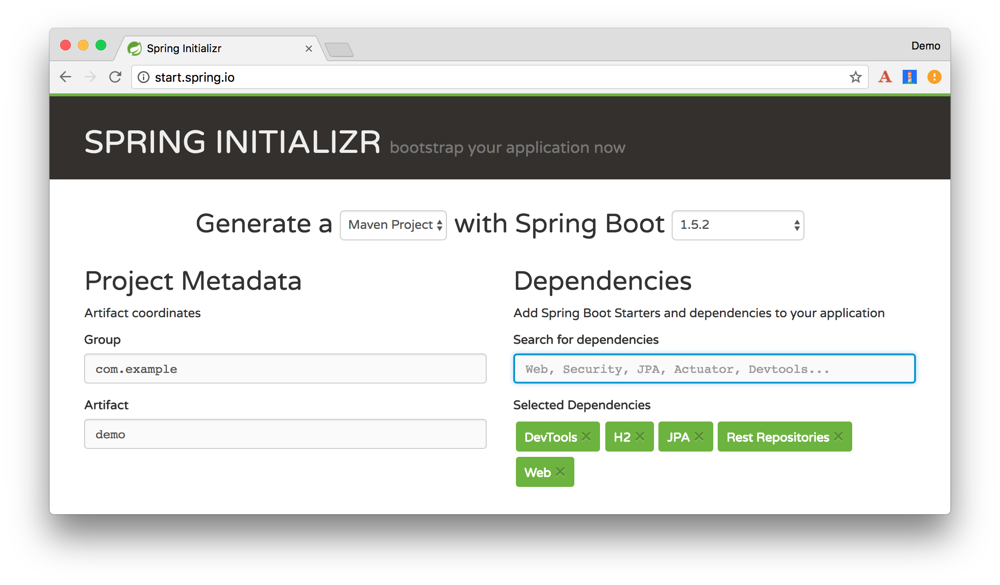
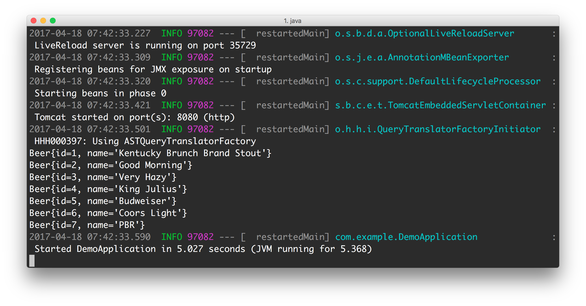
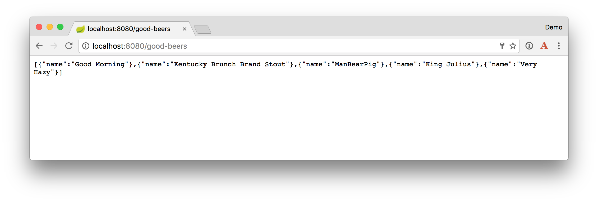
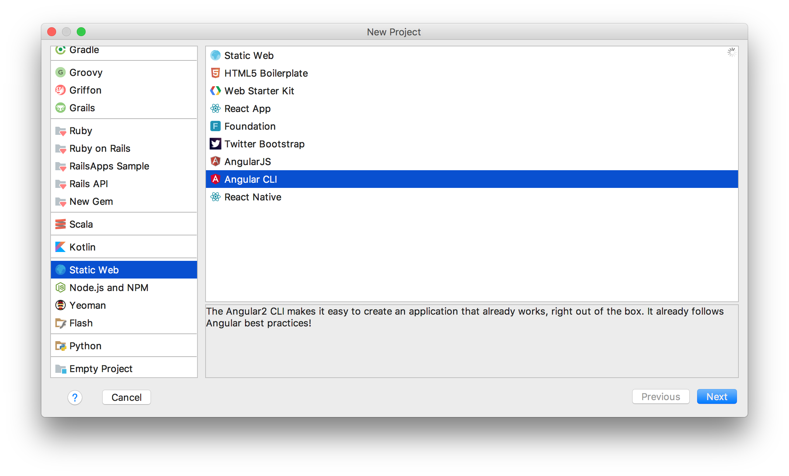
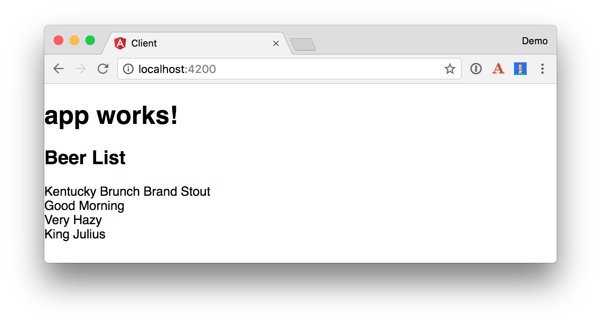
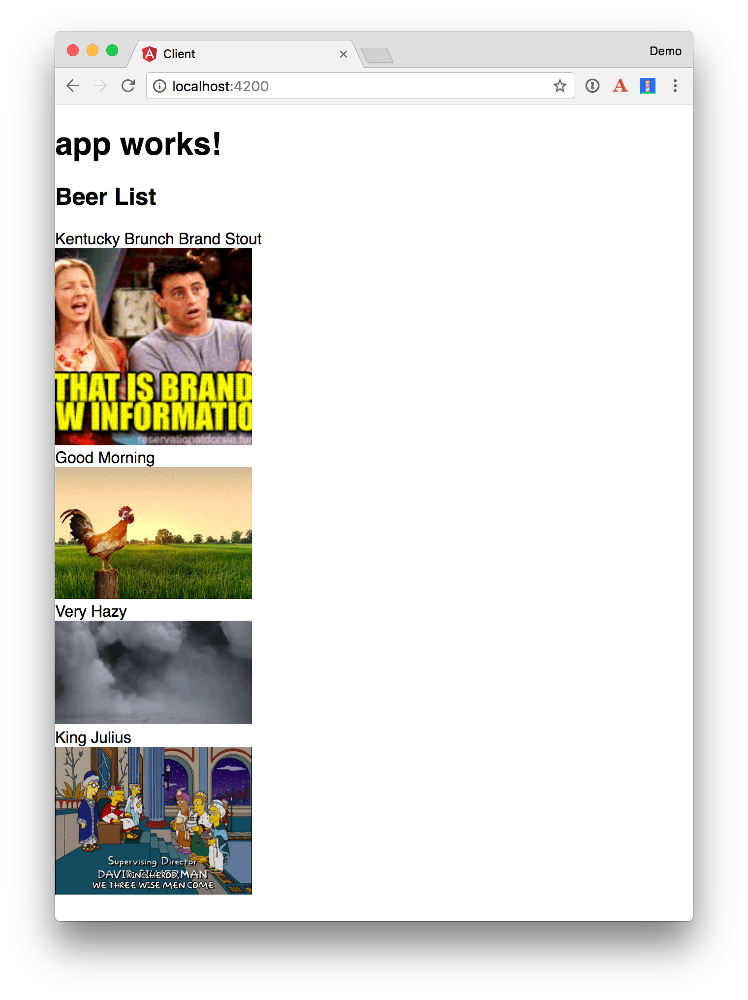

Spring Boot has greatly simplified how to develop applications with Spring. Its auto-configuration and many starters has fostered a Spring renaissance that makes developing Spring apps fun again! Angular is one of the most popular JavaScript MVC frameworks. One of the easiest ways to build Angular apps is using Angular CLI and TypeScript. In this tutorial, you’ll be using Angular to develop a client that talks to a Spring Boot API. 

[ThoughtWorks Technology Radar](https://www.thoughtworks.com/radar) is a document that describes changes that ThoughtWorks thinks are currently interesting in software development. They've recently stated that [Spring Boot should be adopted](https://www.thoughtworks.com/radar/languages-and-frameworks/spring-boot) (Nov 2016) and that [Angular 2 should be assessed](https://www.thoughtworks.com/radar/languages-and-frameworks/angular-2) (Mar 2017). Angular 4 was [released on March 23, 2017](http://angularjs.blogspot.de/2017/03/angular-400-now-available.html) with many performance improvements, so it might move to trial in the next radar.

This article will show you how to create REST endpoints with Spring Data REST, configure Spring Boot to allow CORS, and create an Angular app to display its data. This app will display a list of beers from the API, then fetch a GIF from <http://giphy.com> that matches the beer’s name. In a future article, I’ll show you how to turn this application into an PWA (Progressive Web Application) that works without a network connection.

## Build an API with Spring Boot

To get started with Spring Boot, navigate to [start.spring.io](https://start.spring.io). In the “Search for dependencies" field, select the following: 

* DevTools
* H2
* JPA
* Rest Repositories
* Web



If you like the command-line better, you can use the following command to download a `demo.zip` file with [HTTPie](https://httpie.org/).

<pre>
http https://start.spring.io/starter.zip \
dependencies==devtools,h2,data-jpa,data-rest,web -d
</pre>

Create a directory called `spring-boot-angular`, with a `server` directory inside it. Expand the contents of `demo.zip` into the `server` directory. 

Open the “server" project in your favorite IDE and run `DemoApplication` or start it from the command line using `./mvnw spring-boot:run`. 

Create a `com.example.beer` package and a `Beer.java` file in it. This will be the entity that holds your data.

```java
package com.example.beer;

import javax.persistence.Entity;
import javax.persistence.GeneratedValue;
import javax.persistence.Id;

@Entity
public class Beer {

    @Id
    @GeneratedValue
    private Long id;
    private String name;

    public Beer() {}

    public Beer(String name) {
        this.name = name;
    }

    public Long getId() {
        return id;
    }

    public void setId(Long id) {
        this.id = id;
    }

    public String getName() {
        return name;
    }

    public void setName(String name) {
        this.name = name;
    }

    @Override
    public String toString() {
        return "Beer{" +
                "id=" + id +
                ", name='" + name + '\'' +
                '}';
    }
}
```

Add a `BeerRepository` class that leverages Spring Data to do CRUD on this entity.

```java
package com.example.beer;

import org.springframework.data.jpa.repository.JpaRepository;

interface BeerRepository extends JpaRepository<Beer, Long> {
}
```

Add a `BeerCommandLineRunner` that uses this repository and creates a default set of data.

```java
package com.example.beer;

import org.springframework.boot.CommandLineRunner;
import org.springframework.stereotype.Component;

import java.util.stream.Stream;

@Component
public class BeerCommandLineRunner implements CommandLineRunner {

    private final BeerRepository repository;

    public BeerCommandLineRunner(BeerRepository repository) {
        this.repository = repository;
    }

    @Override
    public void run(String... strings) throws Exception {
        // top 5 beers from https://www.beeradvocate.com/lists/top/
        Stream.of("Good Morning", "Kentucky Brunch Brand Stout", "ManBearPig", "King Julius", 
                  "Very Hazy", "Budweiser", "Coors Light", "PBR").forEach(name ->
                repository.save(new Beer(name))
        );
        System.out.println(repository.findAll());
    }
}
```

Rebuild your project and you should see a list of beers printed in your terminal.

 

Add a [`@RepositoryRestResource`](http://docs.spring.io/spring-data/rest/docs/current/api/org/springframework/data/rest/core/annotation/RepositoryRestResource.html) annotation to `BeerRepository` to expose all its CRUD operations as REST endpoints.

```java
import org.springframework.data.rest.core.annotation.RepositoryRestResource;

@RepositoryRestResource
interface BeerRepository extends JpaRepository<Beer, Long> {
}
```

Add a `BeerController` class to create an endpoint that filters out less-than-great beers.

```java
package com.example.beer;

import org.springframework.web.bind.annotation.GetMapping;
import org.springframework.web.bind.annotation.RestController;

import java.util.Collection;
import java.util.HashMap;
import java.util.Map;
import java.util.stream.Collectors;

@RestController
public class BeerController {
    private BeerRepository repository;

    public BeerController(BeerRepository repository) {
        this.repository = repository;
    }

    @GetMapping("/good-beers")
    public Collection<Map<String, String>> goodBeers() {

        return repository.findAll().stream()
                .filter(this::isGreat)
                .map(b -> {
                    Map<String, String> m = new HashMap<>();
                    m.put("name", b.getName());
                    return m;
                }).collect(Collectors.toList());
    }

    private boolean isGreat(Beer beer) {
        return !beer.getName().equals("Budweiser") &&
                !beer.getName().equals("Coors Light") &&
                !beer.getName().equals("PBR");
    }
}
```

Re-build your application and navigate to http://localhost:8080/good-beers. You should see the list of good beers in your browser.

 

You should also see this same result in your terminal window when using HTTPie.

```bash
http localhost:8080/good-beers
```

## Create a project with Angular CLI

It’s cool that you created an API to display a list of beers, but APIs aren’t _that_ cool without a UI. In this section, you’ll create a new Angular app, build services to fetch beers/images, and create components to display this data.

To create an Angular project, make sure you have [Node.js](https://nodejs.org/) and the latest [Angular CLI installed](https://github.com/angular/angular-cli#updating-angular-cli).

```bash
npm uninstall -g angular-cli @angular/cli
npm cache clean
npm install -g @angular/cli@latest
```

Run `ng --version` to confirm you’re using version 1.0.0 (or later). From a terminal window, cd into the root of the `spring-boot-angular-pwa` directory and run the following command.

```bash
ng new client
```

This will create a new `client` directory and run `npm install` to install all the necessary dependencies. To verify everything works, run `ng e2e` in a terminal window. If everything works, you should see output like the following in your terminal.

```bash
[09:02:35] I/direct - Using ChromeDriver directly...
[09:02:35] I/launcher - Running 1 instances of WebDriver
Spec started

  client App
    ✓ should display message saying app works

Executed 1 of 1 spec SUCCESS in 0.77 sec.
[09:02:38] I/launcher - 0 instance(s) of WebDriver still running
[09:02:38] I/launcher - chrome #01 passed
```

**TIP:** If you’re just getting started with Angular, you might want to [watch a video of my resent Getting Started with Angular webinar](https://www.youtube.com/watch?v=Jq3szz2KOOs).

If you’d rather not use the command line and have [IntelliJ IDEA](https://www.jetbrains.com/idea/) (or [WebStorm](https://www.jetbrains.com/webstorm/)) installed, you can create a new Static Web Project and select Angular CLI.



### Create a BeerListComponent and BeerService

Thus far, you’ve created a `good-beers` API and an Angular app, but you haven’t created the UI to display the list of beers from your API. To do this, create a `<beer-list>` component by running Angular CLI’s `generate component` command.

```bash
$ ng generate component beer-list
installing component
  create src/app/beer-list/beer-list.component.css
  create src/app/beer-list/beer-list.component.html
  create src/app/beer-list/beer-list.component.spec.ts
  create src/app/beer-list/beer-list.component.ts
  update src/app/app.module.ts
```

**TIP:** There is a `g` alias for `generate` and a `c` alias for `component`, so you can type `ng g c beer-list` too.

Create a `beer` service:

```bash
$ ng g s beer
installing service
  create src/app/beer.service.spec.ts
  create src/app/beer.service.ts
  WARNING Service is generated but not provided, it must be provided to be used
```

Create a `src/app/shared/beer` directory and move `beer.service.*` into it.

```bash
mkdir -p src/app/shared/beer
mv src/app/beer.service.* src/app/shared/beer/.
```

Create a `src/app/shared/index.ts` file and export the `BeerService`. The reason for this file is so you can export multiple classes and import them on one line rather than multiple.

```typescript
export * from './beer/beer.service';
```

Modify `beer.service.ts` to call the “good-beers" API service.

```typescript
import { Injectable } from '@angular/core';
import { Http, Response, RequestOptions } from '@angular/http';
import { Observable } from 'rxjs';

@Injectable()
export class BeerService {

  constructor(private http: Http) {}

  getAll(): Observable<any> {
    return this.http.get('http://localhost:8080/good-beers')
      .map((response: Response) => response.json());
  }
}
```

Modify `beer-list.component.ts` to use the `BeerService` and store the results in a local variable. Notice that you need to add the service as a provider in the `@Component` definition or you will see an error.

```typescript
import { Component, OnInit } from '@angular/core';
import { BeerService } from '../shared/index';

@Component({
  selector: 'app-beer-list',
  templateUrl: './beer-list.component.html',
  styleUrls: ['./beer-list.component.css'],
  providers: [BeerService]
})
export class BeerListComponent implements OnInit {
  beers: Array<any>;

  constructor(private beerService: BeerService) { }

  ngOnInit() {
    this.beerService.getAll().subscribe(
      data => {
        this.beers = data;
      },
      error => console.log(error)
    )
  }
}
```

Modify `beer-list.component.html` so it renders the list of beers.

```html
<h2>Beer List</h2>

<div *ngFor="let b of beers">
  {{b.name}}
</div>
```

Update `app.component.html` to have the `BeerListComponent` rendered when you’re logged in. 

```html
<app-beer-list></app-beer-list>
```

Make sure both apps are started (with `mvn spring-boot:run` in the server directory, and `ng serve` in the client directory) and navigate to http://localhost:4200. You should see an error in your console that you means you have to configure cross-origin resource sharing (CORS) on the server.

<pre style="color: red">
XMLHttpRequest cannot load http://localhost:8080/me. Response to preflight request doesn't 
pass access control check: No 'Access-Control-Allow-Origin' header is present on the requested 
resource. Origin 'http://localhost:4200' is therefore not allowed access. The response had HTTP 
status code 401.
</pre>

To fix this issue, you’ll need to configure Spring Boot to allow cross-domain access from `http://localhost:4200`.

### Configure CORS for Spring Boot 

In the server project, open `BeerController.java` and add a `@CrossOrigin` annotation to enable cross-origin resource sharing (CORS) from the client (http://localhost:4200).

```java
import org.springframework.web.bind.annotation.CrossOrigin;

...

    @GetMapping("/good-beers")
    @CrossOrigin(origins = "http://localhost:4200")
    public Collection<Map<String, String>> goodBeers() {
```

After making these changes, you should be able to see a list of beers from your Spring Boot API.



To make it look a little better, add a [Giphy](http://giphy.com) service to fetch images based on the beer’s name. Create `src/app/shared/giphy/giphy.service.ts` and place the following code inside it.

```typescript
import { Injectable } from '@angular/core';
import { Http, Response } from '@angular/http';
import { Observable } from 'rxjs';

@Injectable()
// http://tutorials.pluralsight.com/front-end-javascript/getting-started-with-angular-2-by-building-a-giphy-search-application
export class GiphyService {

  giphyApi = '//api.giphy.com/v1/gifs/search?api_key=dc6zaTOxFJmzC&q=';

  constructor(public http: Http) {}

  get(searchTerm): Observable<any> {
    let apiLink = this.giphyApi + searchTerm;
    return this.http.request(apiLink).map((res: Response) => {
      let giphies = res.json().data;
      return giphies[0].images.original.url;
    });
  }
}
```

Add an export for this class in `src/app/shared/index.ts`.

```typescript
export * from './beer/beer.service';
export * from './giphy/giphy.service';
```

Then add it to `BeerListComponent` to set a `giphyUrl` on each `beer` object.

```typescript
import { Component, OnInit } from '@angular/core';
import { BeerService, GiphyService } from '../shared/index';

@Component({
  selector: 'app-beer-list',
  templateUrl: './beer-list.component.html',
  styleUrls: ['./beer-list.component.css'],
  providers: [BeerService, GiphyService]
})
export class BeerListComponent implements OnInit {
  beers: Array<any>;

  constructor(private beerService: BeerService,
              private giphyService: GiphyService) { }

  ngOnInit() {
    this.beerService.getAll().subscribe(
      data => {
        this.beers = data;
        for (let beer of this.beers) {
          this.giphyService.get(beer.name).subscribe(url => beer.giphyUrl = url);
        }
      },
      error => console.log(error)
    )
  }
}
```

Then update `beer-list.component.html` to include a reference to this image.

```html
<div *ngFor="let b of beers">
  {{b.name}}<br>
  
</div>
```

The result should look something like the following list of beer names with images.



You’ve just created an Angular app that talks to a Spring Boot API using cross-domain requests. Congratulations! 

## Source Code
You can find the source code associated with this article [on GitHub](https://github.com/oktadeveloper/spring-boot-angular-example). If you find any bugs, please file an issue on GitHub, or ask your question on Stack Overflow with the "okta" tag. Of course, you can always [ping me on Twitter](https://twitter.com/mraible) too.

## What’s Next?

In a future article, I’ll show you how to create a progressive web application and deploy it to the cloud. 

To learn more about Angular, Spring Boot, or Okta, check out the following resources:

* [Angular with OpenID Connect](TBD)
* [Build an Angular App with Okta's Sign-In Widget in 15 Minutes](http://developer.okta.com/blog/2017/03/27/angular-okta-sign-in-widget)
* [Get Started with Spring Boot, OAuth 2.0, and Okta](http://developer.okta.com/blog/2017/03/21/spring-boot-oauth)
* [Get Started with Spring Boot, SAML, and Okta](http://developer.okta.com/blog/2017/03/16/spring-boot-saml)

